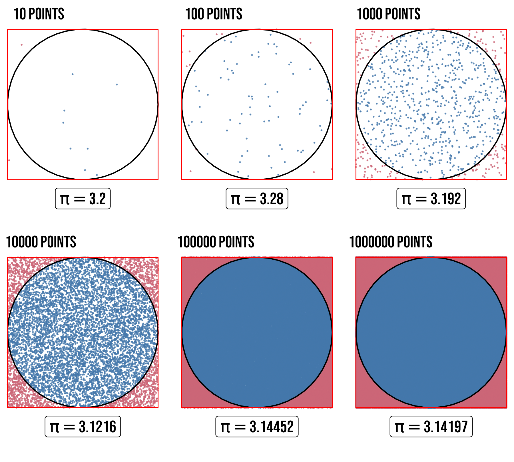
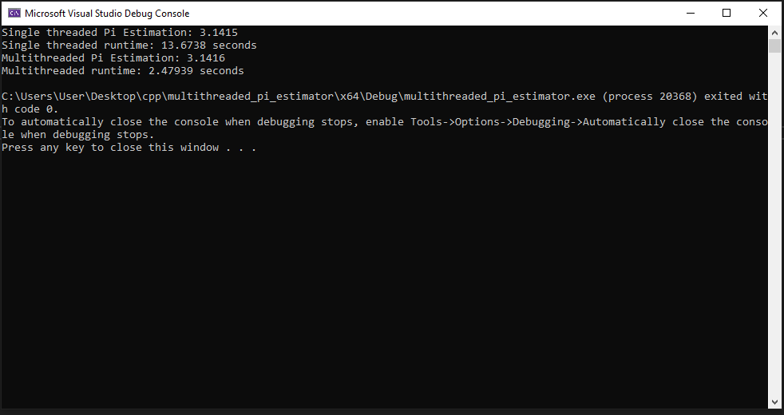

# Multithreaded Pi Estimation using Monte Carlo Method
## Introduction
This application uses the Monte Carlo method to estimate the value of Pi, leveraging multithreading to significantly reduce runtime. By dividing the computation into multiple threads, we can take advantage of modern CPU architectures and speed up the estimation process.

## Methodology
The application uses the standard Monte Carlo method to estimate Pi. The algorithm generates random points within a square and calculates the ratio of points falling within a circle to the total number of points. This ratio is then used to estimate Pi.

## Multithreading
To speed up the computation, the application divides the Monte Carlo runs into multiple threads. Each thread performs a portion of the total runs, and the results are combined to estimate Pi. This approach allows us to utilize multiple CPU cores and reduce the overall runtime.

## Performance
In our testing, we observed a significant reduction in runtime when using multithreading. For 100,000,000 Monte Carlo runs, the runtime decreased from 13 seconds to 2 seconds, resulting in a 6.5x speedup.

